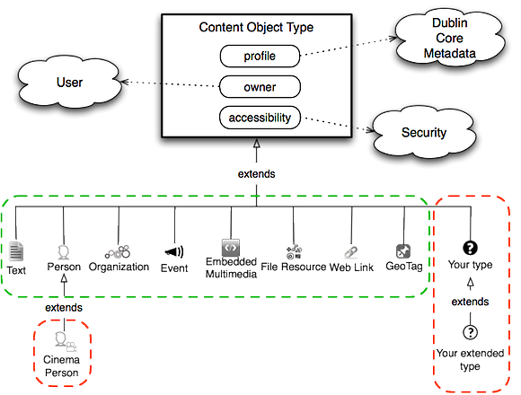
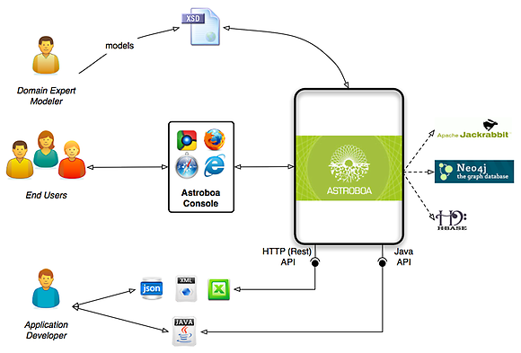

## Astroboa "Open Content Model"
One of the most exciting features of Astroboa is the **completely open and easily expandable content model** that it supports. There are a lot of open source platforms for managing content but how open, standards based, semantics driven, easily expandable and sharable is their content?

In contrast to many other tools and platforms Astroboa does not impose a fixed, "one-size-fits-all" content model (e.g. modeling of web content). It does not enforce squeezing your data in predefined structures. It does not stick to a specific content presentation metaphor (blog, forum, wiki, etc.) and does not favor a specific content domain (i.e. publishing, records management, digital assets management, etc.). It treats your content as a flexible and adaptable structure, a continuously evolving knowledge base.

Astroboa offers a small set of "core constructs" upon which anyone can easily and quickly build custom knowledge / content structures that fit the evolving organizational requirements. The "core constructs" form a foundational organizational structure for all things modeled and stored in Astroboa.

An organization can start with a small and simple content model that can be continuously updated and expanded to a complete knowledge  repository as the organization gains insight about its content assets. Utilizing Astroboa as a central content infrastructure, an organization does not have to continuously move to new tools or gather different databases as more content is collected and more semantic structure is gained. Astroboa follows the idea of **semi-structured content.** When quick solutions are required and no time can be spent in modeling, unstructured or semi-structured content can be stored. Then, more structure can be added as soon as it is needed.

While being so flexible provides a huge benefit in the long run, a predefined content model can be of great value in small projects or when doing the first steps in building an organization's content management infrastructure. In this direction, Astroboa offers a rich set of "ready-made" content types offering different content modeling scenarios to choose from:

*   Use only the "ready-made" content types
*   Extend the "ready-made" content types to build modified types
*   Directly extend the "core constructs" to build new custom types
*   Use a combination of "ready-made", modified and custom types

The "**open content model**" combined with **standardized** methods and tools for defining and storing content, protects the organization's effort and investment in building its content assets and eliminates the need to continuously change tools and technologies as the content evolves.

_Being the "owner" of your content_ and _Building an Evolving Content Infrastructure / Knowledge Base_ are the major goals behind the way Astroboa treats content and approaches content modeling. Astroboa seats transparently between standards for defining and storing content and eases the creation, retrieval, sharing, storing and publishing of content.

## Full Content lifecycle support: Modelling, Creation and Retrieval

### Information Architect / Data modeller
For defining the information model Astroboa uses **XML Schema** (XSD), a standard, straightforward, technology neutral, high level and powerful way to express the hierarchical structure of Semi-Structured information.

From the business / information architect point of view, the content is a set of interconnected information nodes (we call them objects in Astroboa). 
The nodes may model an abstract or real world entity (e. g. news item, blog entry, person, product). Each node has properties. 
The node type determines the available properties and interconnections for each node. The node type is defined through an XML schema. The XML Schema abstracts the low level details of how the information node is stored and allows the Astroboa engine to provide different node representations and use different low level data stores. 

### Content Creator
Content creators view the information nodes as web forms that allow them to input the values of the node properties (e. g. person name, birthday, blog post title, order value, event description, etc.). 

### App / Web Site Developers
Developers view the information nodes as java objects if they use the java API, or as XML / JSON / Excel resources if they use the REST API. 
Since for each node type an XML schema exists, the XML and JSON resources can be automatically validated and preserve the integrity and consistency of the stored data. 
At the same time the XML Schema for each node type can be dynamically adapted to allow new requirements to be instantly implemented and thus facilitates the dynamic schema evolution.

Astroboa puts a lot of emphasis in **providing strong tools for third parties to build content applications** upon Astroboa repositories. 
In the middle way between XML Schemas that define object types (information node types) and the low level repositories that store the object instances, Astroboa automatically generates java objects which map the modeled types and properties to java classes and class fields. 
The [**Java API**](astroboa-java-api.md) (local and remote) allows the developer to search for content and to retrieve, create and store content as java objects (import / export from / to XML and JSON is also supported). 
Additionally the [**Resource API (REST)**](astroboa-resource-api.md) allows to view the stored objects as resources and manage them through URIs. 
Resources (objects) are retrieved and stored through the exchange of XML or JSON that conforms to the content grammar defined in the provided XML Schemas. 
Both the native JAVA API and the Resource API allow content schema introspection. This means that third parties and developers can instantly learn about the available information types and properties in each repository and instantly access them.

### Content Persistence
Concerning the automated content persistence, the Jackrabbit implementation of the [**Java Content Repository**](http://jcp.org/en/jsr/detail?id=170) (JCR) standard is currently used for storing the information nodes. 
The JCR store has been thoroughly tested in production. Other noSQL storage engines, such as graph databases and BigTable implemenations may also be used. 
_Neo4j_ and _HBase_ are currently in experimental use to be fully integrated in future Astroboa versions.

If a JCR store is connected to the Astroboa engine then each element / type defined in the XML Schema is automatically mapped to JCR Nodes and Properties. 
Just dropping XML Schemas into Astroboa results in automatic generation of web forms and automatic storage of submitted web forms into a JCR repository. 
There is an orthogonal approach for any type of stored value either textual, numeric or binary and full text search is available out of the box even for properties that store binary files.

## Content accessibility & reuse
Having your content definition in XML Schemas, being able to search it, share it and export it as fully verified XML Documents in accordance to the defined Schemas and getting all your content in standards based JCR Repositories guarantees the "ownership" and "accessibility" of your content assets. 
It establishes Astroboa as a platform that eases the management of your content without locking you in specific technology implementations and custom made databases. 
Additionally, the future use of big data stores, other than JCR, provides even more possibilities to traverse (through a graph store) and process your data (though an HBase store).

Check [Content Type & Content Object](content-type-and-content-object.md) to learn more about the core modeling constructs and the "ready-made" object types which are provided out of the box to aid the bootstrap of your content model.
